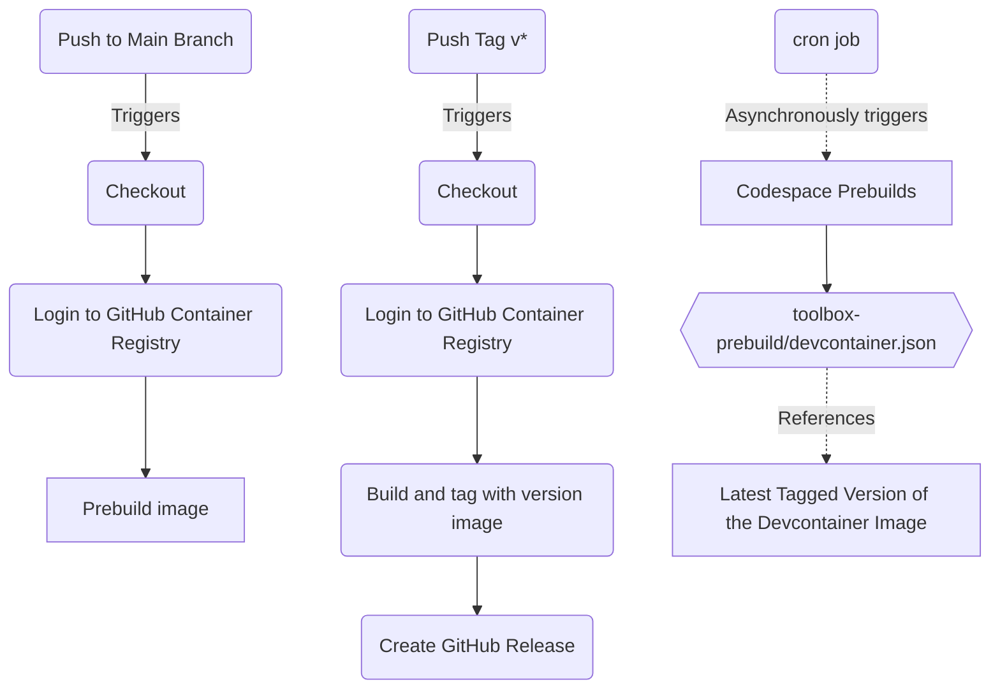

#  toolbox 

A collection of tools and configurations for my development environment.

I use this repository to manage my development environment across different machines, operating systems, containers, and cloud workspaces. The repository is designed to be cloned and run on a Ubuntu or MacOS system (only tested on my computers, ymmv).

## Usage

Besides installation on a local machine, I use this repository to build a `devcontainer` via Github Actions. The latest tagged version is also used to prebuild a `devcontainer` image meant to be used in Codespaces.

>[!NOTE]
>Open a `zsh` shell in the terminal to get started. Regardless of the default profile, codespaces opened in the web client always open with a bash session running initially.

### Local

To run the `toolbox` setup locally, clone the repository and run the `install.sh` script:

    $ git clone https://github.com/ecshreve/toolbox.git ~/.toolbox

    $ cd ~/.toolbox

    $ ./install.sh

The script will check the necessary dependencies and run the `ansible` playbook to configure the environment.

## Why Toolbox?

- I was tired of having do extra work to integrate things with my old `fish` setup. 
- Time to update some tools and look at new ones.
- Wanted to move to ansible for configuration management rather than rely on just an install script and the VSCode dotfiles settings.
- Its fun.

### Highlights
- reliable `zsh` configuration, with plugins and utilities covering almost all of what `fish` was doing for me.
- `mods` configuration to interact with AI models from CLI 
- chatbot to interact with the repository via OpenAI Embeddings, LangChain, and Pinecone
- `gencom` to generate commit messages based on currently staged changes (powered by `mods`)
- devcontainer prebuilt and ready for toolbox installation

<!-- TODO: source these from the vars file? -->
## Aliases and Commands to Remember

- `CTRL+ff` - fuzzy search for files
- `gaa` - add all files to git
- `ga`  - add files to git interactively with `fzf`
- `gbb` - interactive branch selection with `fzf`
- `gcmsg <message>` - commit with a message
- `gcm` - checkout main branch
- `gcp` - interactive cherry-pick with `fzf`
- `gd`  - interactive git diff with `fzf`
- `gdoof` - add all and amend with no message
- `gll` - count lines in staged git diff
- `glo` - interactive git log with `fzf`
- `goops` - reset last commit soft
- `gss` - interactive stash selection with `fzf`
- `gup` - pull with rebase
- `nett` - show open ports

### General CLI Tools
- `bat` - A modern replacement for `cat`
- `exa` - A modern replacement for `ls`
- `fd` - A modern replacement for `find`
- `forgit` - A `fzf` wrapper for `git` commands
- `fzf` - A fuzzy finder for the command line
- `tldr` - A streamlined `man` page replacement

### Go CLI Tools

- `charm` - A utility to manage `charm` apps
- `freeze` - A tool to take screenshots of code
- `gum` - A tool for glamorous shell scripts
- `mods` - An application to interact with the OpenAI API
- `run` - A utility to run commands in a new shell
- `skate` - A utility to manage secrets
- `vhs` - A tool to create gifs from the terminal
- `wishlist` - An SSH directory app

## Toolbox Chat

Toolbox Chat is a Streamlit-based web application designed to facilitate interactive conversations powered by LangChain and OpenAI's GPT models.

It is integrated with Pinecone, a vector database, and LangChain's information retrieval tools to provide a conversational interface to the contents of the repository itself.

  

 
See the [assistant README](assistant/README.md) for more information.

## Environment Setup and Configuration

### Install Script

> [!NOTE]
> Probably don't run the install script unless you're me. But, I'm not the boss of you.

The `install.sh` script is a wrapper around the `ansible-playbook` command that runs the `playbook.yml` file with the `config_vars.yml` file as input. The script is responsible for setting up the environment, checking prerequisites and requirements, parsing cli options, and finally running the playbook.

[usage](#usage)

### Secrets Helper Script

    $ ./scripts/secrets.sh

This script is designed to streamline setting up secrets in my development environment for this project, but can be generally used to dump secrets from a `skate` database to a local file.

  

### Playbook

The `playbook.yml` file is the main entry point for the `ansible` configuration. It handles running the roles defined in the `ansible/roles` directory with the variables defined in `config_vars.yml`.

The playbook can be run with the following command to  see the output in the terminal and log it to a file:

    $ ansible-playbook playbook.yml -v | tee ansible/logs/ansible.log

With ansible-navigator installed, the playbook can be run with the following command to open the TUI:

    $ ansible-navigator run playbook.yml -v 

[ansible-navigator-role](#_beta-roles)
### Configuration

`./config_vars.yml` 
  - Contains the variables used in `playbook.yml`.
  - Things like packages to install, language and tool versions, etc
  
`ansible/hosts` 
  - Defines the `localhost` host and some specific variables related to the env
  - This file only contains the `localhost` host, as all roles are run locally.
  
### Ansible Roles

For environment setup `ansible` is used to manage dotfiles and configurations. 
The roles are defined in the `ansible/roles` directory, and the playbook 
`playbook.yml` is responsible for running them.

**`shell`**

- Installs apt packages (macports ports on darwin).
- Handles the installation and configuration of `zsh` and `oh-my-zsh`, as well 
  as plugins and utilities.
- Configuration for `zsh` is defined in `roles/shell/files/zshrc`, which is 
  copied to `$HOME/.zshrc` after installation. 
- Uses `powerlevel10k` for prompt styling.
- Installs `fzf` and `forgit` for fuzzy searching and git integration.
- Installs `zsh-autosuggestions`, `zsh-completions`, `zsh-syntax-highlighting` 
  for enhanced shell functionality.
- Installs `tmux`.
- Copies dotfiles to home directory

> [!IMPORTANT]
> The `.zshrc` configuration defines a keybinding override to use `^ff` instead of `^t` to trigger `fzf` from the command line.

**`golang`**:

- Handles downloading and installing Golang 1.22.2, along with additional tools 
  and executables.
- Installs go under `/usr/local/go`
- Installs executables under `/usr/local/go/bin`
- Install path is defined in config_vars.yml

**`python`**

- Installs and configures `pyenv` and `pyenv-virtualenv` for managing Python 
  versions and virtual environments.
- Installs Python 3.12.2 and sets it as the global version.

**`hashi`**

- Adds the HashiCorp repository to the system.
- Installs `terraform` and `packer` via `apt` on Ubuntu
- TODO: Add support for MacOS

**`cleanup`**

- This role is run last (or should be)
- Checks that ownership is correct for a few directories.
- Could be expanded to do more cleanup tasks.

### _beta roles

These aren't fully integrated yet, but I've played around with them and they're pretty cool.

**`ansible-navigator`**

- A text-based user interface (TUI) for Ansible.
- Installed via `pip` as part of the `navigator` role.

**`navi`**

- A command-line cheatsheet tool.

## Builds and Releases

General outline of what images get build where.

`toolbox-devcontainer:latest` is built on push to main and tagged as the latest version. This image is used in developing _this_ repository. 

`toolbox-devcontainer:v*` is built on push of a tag that starts with `v`. This image is used in the Codespace prebuilds. I use this image as a devcontainer in other repositories.

`codespace-prebuild`: A workflow that runs on a cron job and configured via the repository settings in the Github UI. Prebuilds are configured to target the latest tagged version of the devcontainer image.

## Ideas

todo
- [ ] play around with tmux config
- [ ] helper scripts
- [ ] fzf run tasks helper
- [ ] add mods roles and helper scripts
- [ ] move logic to clone toolbox into install.sh
- [ ] revisit cleanup role and file ownership
- [ ] reindex pinecone on push to main?
- [ ] demo the assistant in the readme

maybe
- [ ] Add `soft serve` git server
- [ ] Add `run` configuration
- [-] figure out copy/paste from cli
- [ ] Use run in ci?
- [ ] Rethink python install

done
- [x] Use `skate` to handle secrets
- [x] Bake all of this into a docker image
- [x] Launch in codespace as a demo?
- [x] run container build on push to main?
- [x] write docs for assistant
- [x] move config values out of playbook
- [x] python environment setup
- [x] upgrade to go 1.22
- [x] refactor playbook vars
- [x] Take a few cycles to clean up the `golang` role.
- [x] Audit .yml vs ~~.yaml~~ file extensions
- [x] Add `tmux` configuration
- [x] Add `aliases` to .zshrc
- [x] Configure `charm` server to run via docker

## Links

- [charmbracelet](https://charm.sh/)
- [ansible](https://docs.ansible.com/ansible/latest/index.html)
- [ansible-navigator](https://github.com/ansible/ansible-navigator) |
[docs](https://ansible.readthedocs.io/projects/navigator/)
- [golang](https://golang.org/doc/) | [go installation](https://golang.org/doc/install)
- [forgit](https://github.com/wfxr/forgit)
- [fzf](https://github.com/junegunn/fzf)
- [zsh](https://www.zsh.org/)
- [oh-my-zsh](https://ohmyz.sh/)
- [terraform](https://www.terraform.io/)
- [packer](https://www.packer.io/)
- [navi](
- [powerlevel10k](
- [pyenv](
- [pyenv-virtualenv](
