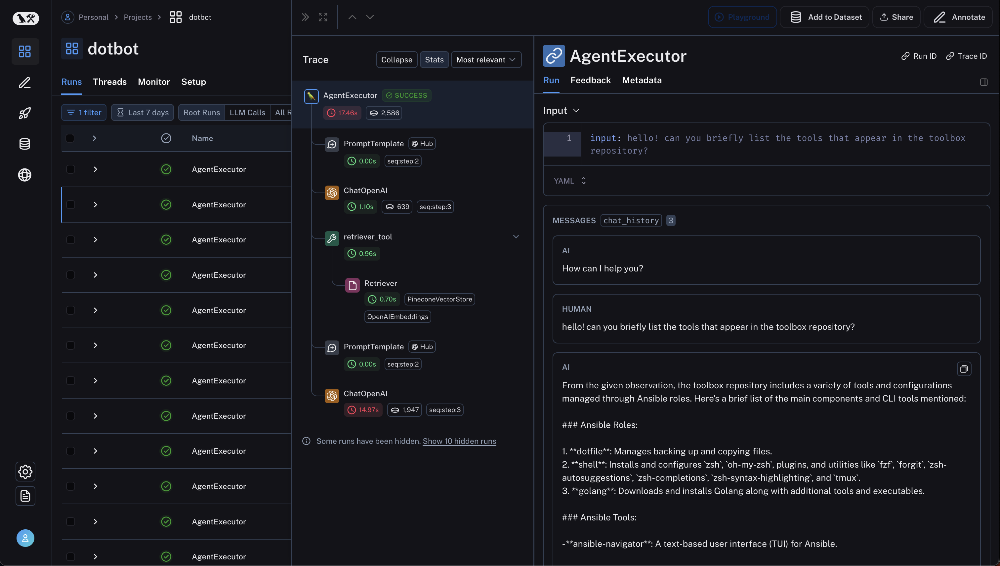

# Toolbox Chat  

Toolbox Chat is a Streamlit-based web application designed to facilitate interactive conversations powered by LangChain and OpenAI's GPT models. 

It also integrates with Pinecone, a vector database, and LangChain's information retrieval tools to provide a conversational interface to the contents of the repository itself.

## Features

- **Interactive Chat Interface**: Engage in conversations with an AI assistant, powered by GPT-4 and enhanced with LangChain's integration capabilities.
- **Persistent Chat History**: Keep track of your conversation as you interact with the application. 
    >[!IMPORTANT]
Persistence is limited to the duration of the session in the current implementation.    
- **Multiple Information Retrieval Tools**: Access information from diverse sources like Wikipedia, custom search tools, and vector-based retrieval systems, all within the chat interface.
- **Environment Configuration Check**: Quickly verify if your environment meets the necessary configuration requirements directly from the UI.


## Usage

>[!NOTE] 
>This is a work in progress and hasn't been tested outside my laptop.

### Prerequisites

- Python 3.11.8 or later
- Pip for Python package installation
- API keys

### Running the App

Start the Streamlit app by running:

```bash
streamlit run app.py
```

Navigate to the URL provided in your terminal to interact with Toolbox Chat.

---

## Screenshots

Streamlit chat interface


<br/>
Tracing with Langsmith


## References

- [Streamlit Documentation](https://docs.streamlit.io/)
- [OpenAI API Documentation](https://platform.openai.com/docs/overview)
- [Pinecone Documentation](https://www.pinecone.io/docs/)
- [LangChain Documentation](https://python.langchain.com/docs/get_started/quickstart)
- [Langsmith Documentation](https://docs.smith.langchain.com/)